Learn how to build a modern mobile app with Expo, React Native, NativeWind (Tailwind CSS), and Strapi CMS. This step-by-step guide covers everything from project setup to implementing a blog with infinite scroll.

## What We're Building


By the end of this tutorial, you'll have a fully functional React Native app that:

- Fetches content from a Strapi headless CMS
- Renders dynamic block-based landing pages
- Displays a blog with infinite scroll
- Uses tab navigation between Home and Blog screens
- Works on iOS, Android, and web

**Tech Stack:**
- **Expo** - React Native framework with great DX
- **Expo Router** - File-based routing
- **NativeWind** - Tailwind CSS for React Native
- **Strapi** - Headless CMS for content management
- **React Query** - Data fetching and caching
- **TypeScript** - Type safety throughout

---
## Why Expo, React Native, and Strapi?

Building mobile apps traditionally meant learning separate languages for iOS (Swift) and Android (Kotlin/Java), doubling your development effort. **React Native** changes that by letting you write once in JavaScript/TypeScript and deploy to both platforms - plus the web.

**Expo** takes React Native further by removing the complexity of native tooling. No Xcode or Android Studio headaches for most development. Just write code and scan a QR code to see it running on your phone. It's the fastest way to go from idea to working app.

**Strapi** is an open-source headless CMS that gives you a complete backend without writing server code. You get:
- A visual admin panel to manage content
- Auto-generated REST and GraphQL APIs
- User authentication built-in
- Full control over your data (self-hosted or cloud)

**Why this stack works well together:**

| Concern | Solution | Benefit |
|---------|----------|---------|
| Cross-platform UI | React Native + Expo | One codebase for iOS, Android, and web |
| Styling | NativeWind (Tailwind) | Familiar utility classes, rapid prototyping |
| Content management | Strapi | Non-developers can update content without code changes |
| Data fetching | React Query | Caching, background updates, offline support |
| Navigation | Expo Router | File-based routing |

This combination is ideal for content-driven apps like blogs, news apps, e-commerce, portfolios, or any app where content changes frequently and you want marketing teams to update it without developer involvement.

---


## Prerequisites

Before starting, make sure you have:

- Node.js (v20 or higher)
- npm or yarn
- A code editor (VS Code recommended)
- iOS Simulator (Mac) or Android Emulator, or Expo Go app on your phone

---

## Part 1: Setting Up the Expo Project

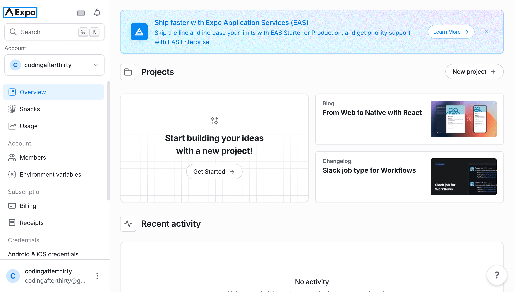

### Step 1.1: Create the Project

We'll use `create-expo-app` to scaffold a new Expo project:

```bash
npx create-expo-app@latest
```

When prompted, name your app `client`. This creates a fully configured React Native project with TypeScript support.

Navigate to your project:

```bash
cd client
```

### Step 1.2: Test the Setup

Start the Expo development server:

```bash
npx expo start --go
```

The `--go` flag ensures you're running in Expo Go mode. You'll see a QR code in your terminal.

**Running on your phone:**
1. Download "Expo Go" from the App Store (iOS) or Play Store (Android)
2. Scan the QR code with your camera (iOS) or Expo Go app (Android)
3. Make sure your phone and computer are on the same WiFi network

> **Tip:** If connection fails, press `s` in the terminal to switch to Tunnel mode.

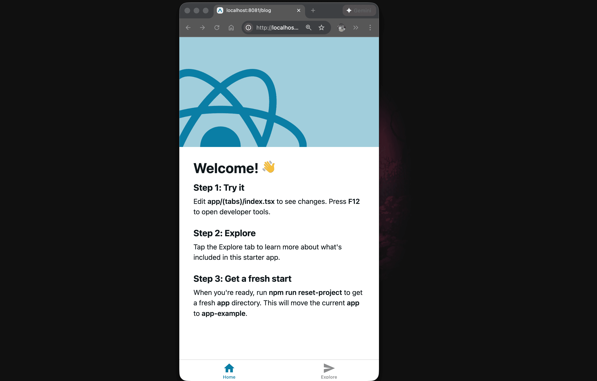

---

## Part 2: Setting Up NativeWind (Tailwind CSS)

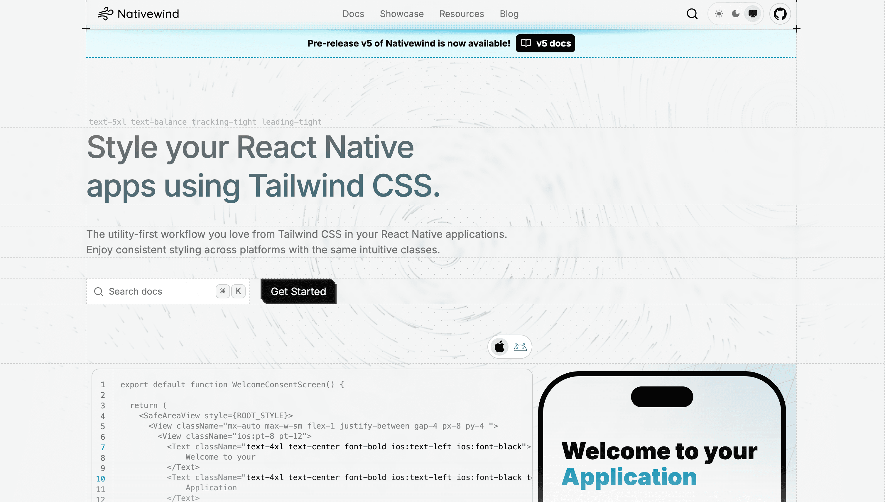

NativeWind lets you use Tailwind CSS utility classes in React Native, making styling faster and more consistent.

### Step 2.1: Install Dependencies

```bash
# Runtime dependencies
npx expo install nativewind react-native-reanimated react-native-safe-area-context

# Dev dependencies
npm install --dev tailwindcss@^3.4.17 prettier-plugin-tailwindcss@^0.5.11
```

> **Important:** Use `npx expo install` for React Native packages - Expo automatically selects compatible versions.

### Step 2.2: Generate Config Files

```bash
npx expo customize metro.config.js
npx expo customize babel.config.js
npx tailwindcss init
```

### Step 2.3: Configure tailwind.config.js

```javascript
/** @type {import('tailwindcss').Config} */
module.exports = {
  content: [
    "./app/**/*.{js,jsx,ts,tsx}",
    "./components/**/*.{js,jsx,ts,tsx}",
  ],
  presets: [require("nativewind/preset")],
  theme: {
    extend: {},
  },
  plugins: [],
};
```

### Step 2.4: Configure metro.config.js

```javascript
const { getDefaultConfig } = require("expo/metro-config");
const { withNativeWind } = require("nativewind/metro");

const config = getDefaultConfig(__dirname);

module.exports = withNativeWind(config, { input: "./global.css" });
```

### Step 2.5: Configure babel.config.js

```javascript
module.exports = function (api) {
  api.cache(true);
  return {
    presets: [
      ["babel-preset-expo", { jsxImportSource: "nativewind" }],
      "nativewind/babel",
    ],
  };
};
```

### Step 2.6: Create global.css

Create a `global.css` file in your project root:

```css
@tailwind base;
@tailwind components;
@tailwind utilities;

:root {
  --primary: #0d6c9a;
  --secondary: #f3cf36;
  --tertiary: #1d6976;
  --dark: #132134;
}
```

### Step 2.7: Add TypeScript Support

Create `nativewind-env.d.ts` in your project root:

```typescript
/// <reference types="nativewind/types" />
```

---

## Part 3: Reset and Configure the Project

### Step 3.1: Reset to a Clean Slate

Run the reset script to remove the boilerplate:

```bash
npm run reset-project
```

Choose `n` to delete the example files completely.

### Step 3.2: Configure the Root Layout

Update `app/_layout.tsx`:

```typescript
import "@/global.css";
import { Stack } from "expo-router";
import { SafeAreaProvider } from "react-native-safe-area-context";

export default function RootLayout() {
  return (
    <SafeAreaProvider>
      <Stack />
    </SafeAreaProvider>
  );
}
```

### Step 3.3: Add Custom Colors to Tailwind

Update `tailwind.config.js` to use your CSS variables:

```javascript
/** @type {import('tailwindcss').Config} */
module.exports = {
  content: ["./app/**/*.{js,jsx,ts,tsx}", "./components/**/*.{js,jsx,ts,tsx}"],
  presets: [require("nativewind/preset")],
  theme: {
    extend: {
      colors: {
        primary: "var(--primary)",
        secondary: "var(--secondary)",
        tertiary: "var(--tertiary)",
        dark: "var(--dark)",
      },
    },
  },
  plugins: [],
};
```

### Step 3.4: Test NativeWind

Update `app/index.tsx`:

```typescript
import { Text, View } from "react-native";

export default function Index() {
  return (
    <View className="flex-1 items-center justify-center gap-4 bg-dark p-8">
      <Text className="text-2xl font-bold text-white">
        NativeWind is working!
      </Text>
      <View className="w-full rounded-lg bg-primary p-4">
        <Text className="text-center font-semibold text-white">
          Primary Color
        </Text>
      </View>
    </View>
  );
}
```

Start the app to verify:

```bash
npx expo start --go --clear
```

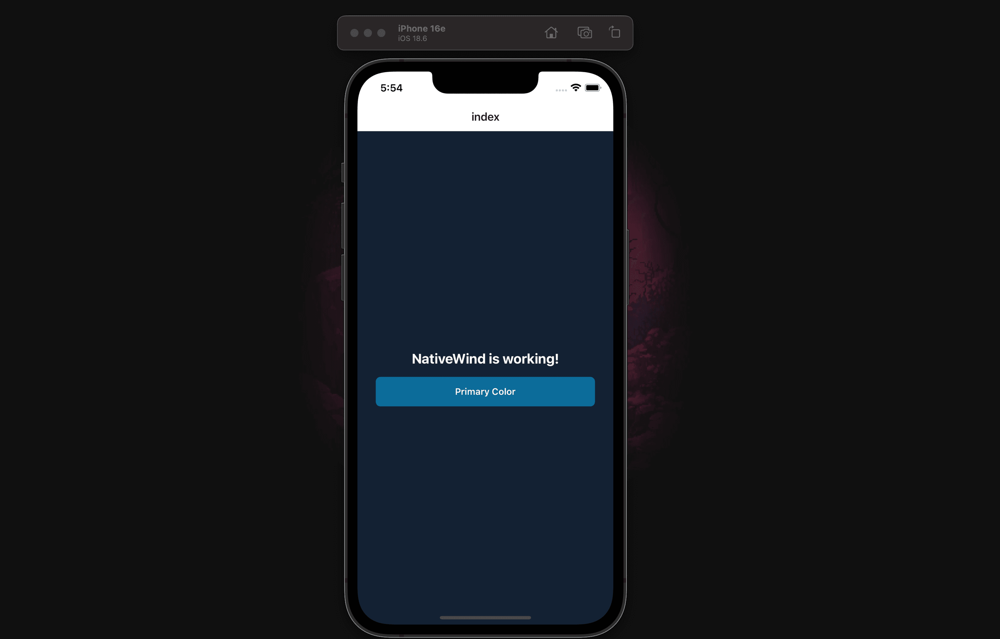

---

## Part 4: Setting Up Strapi Backend

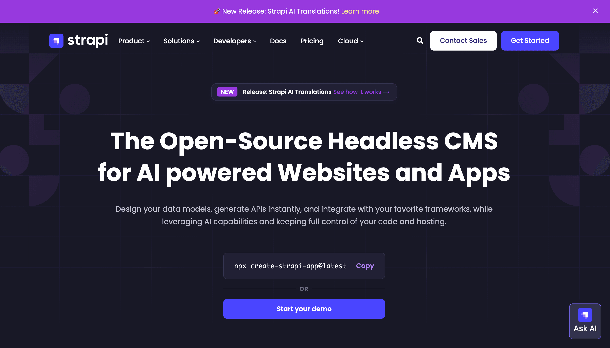

Instead of building from scratch, we'll use a pre-configured Strapi starter with sample data.

### Step 4.1: Clone the Starter

From your project root (not inside `client`):

```bash
git clone https://github.com/PaulBratslavsky/pauls-strapi-crashcourse.git server
```

Your folder structure should now be:

```
your-project/
├── client/     # React Native app
└── server/     # Strapi backend
```

### Step 4.2: Install and Configure

```bash
cd server
npm install
cp .env.example .env
```

### Step 4.3: Import Sample Data

```bash
  npm run strapi -- import -f ./seed-data.tar.gz
```

Type `Yes` when prompted. This imports articles, authors, tags, and a landing page.

### Step 4.4: Start Strapi

```bash
npm run develop
```

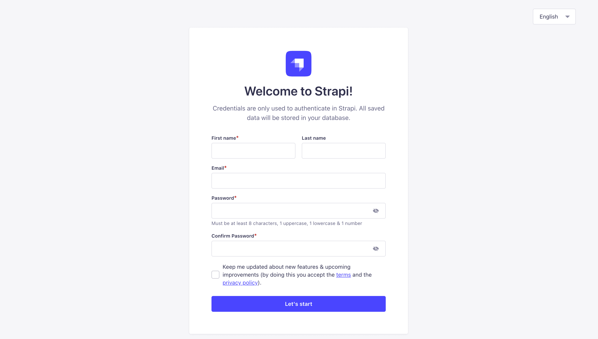

Create your admin account when prompted, then navigate to **Content Manager** to see the seeded content.

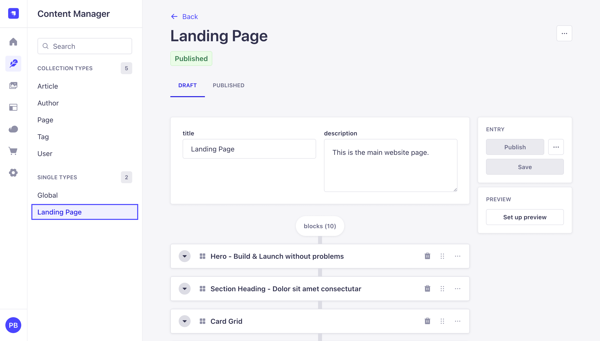

### Step 4.5: Configure API Permissions

1. Go to **Settings** → **Users & Permissions Plugin** → **Roles**
2. Click **Public**
3. Under each content type, check **find** and **findOne**
4. Click **Save**

Should already be enabled.

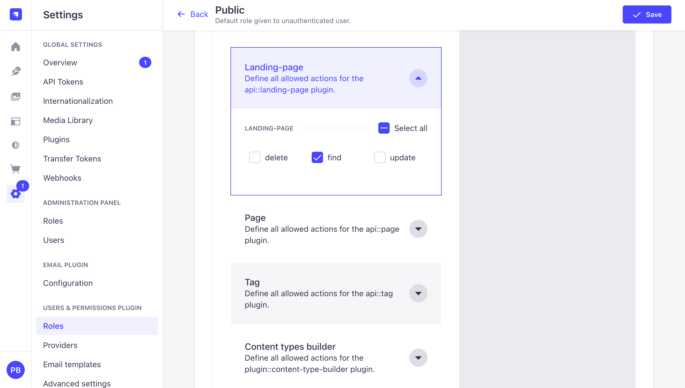

Test the API by making a `GET` request to `http://localhost:1337/api/landing-page`.

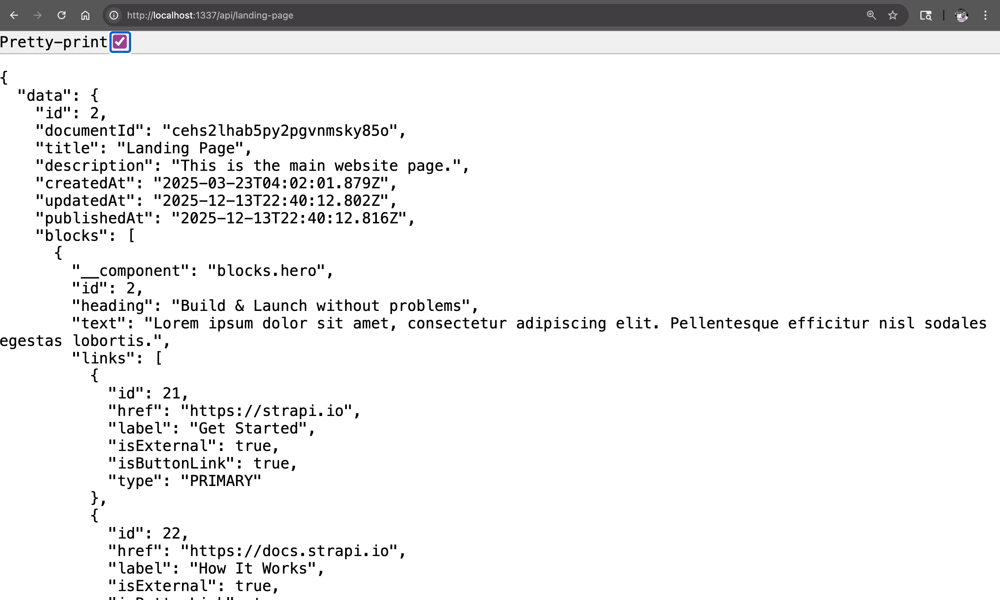

---

## Part 5: Data Fetching Setup

We'll use `fetch` to get data from our Strapi API, with the `qs` library for building query strings and React Query for caching.

### Step 5.1: Install Dependencies

In your `client` directory:

```bash
npm install qs @tanstack/react-query
npm install --save-dev @types/qs
```

### Step 5.2: Create Utility Functions

Create `lib/utils.ts`:

```typescript
const STRAPI_URL = process.env.EXPO_PUBLIC_STRAPI_URL || "http://localhost:1337";

export function getStrapiURL(): string {
  return STRAPI_URL;
}

export function getStrapiMedia(url: string | null): string | null {
  if (!url) return null;
  if (url.startsWith("http")) return url;
  return `${getStrapiURL()}${url}`;
}
```

> **For Physical Devices:** Create a `.env` file with your computer's IP address:
> ```
> EXPO_PUBLIC_STRAPI_URL=http://192.168.1.100:1337
> ```

### Step 5.3: Create the Strapi API Helper

We'll create a simple API helper using `fetch` and the `qs` library for query string formatting.

Create `lib/strapi-api.ts`:

```typescript
import qs from "qs";
import { getStrapiURL } from "@/lib/utils";

const BASE_URL = getStrapiURL();

interface QueryOptions {
  populate?: object | boolean;
  filters?: object;
  sort?: string[];
  pagination?: {
    page?: number;
    pageSize?: number;
  };
  fields?: string[];
}

async function fetchAPI<T>(endpoint: string, options?: QueryOptions): Promise<T> {
  const url = new URL(`/api/${endpoint}`, BASE_URL);
  if (options) {
    url.search = qs.stringify(options, { encode: false });
  }

  const response = await fetch(url.href, {
    headers: {
      "Content-Type": "application/json",
    },
  });

  if (!response.ok) {
    const text = await response.text();
    console.error("API error response:", text);
    throw new Error(`API error: ${response.status} ${response.statusText}`);
  }

  return response.json();
}

function single(singularApiId: string) {
  return {
    find: <T>(options?: QueryOptions) => fetchAPI<T>(singularApiId, options),
  };
}

function collection(pluralApiId: string) {
  return {
    find: <T>(options?: QueryOptions) => fetchAPI<T>(pluralApiId, options),
  };
}

export const strapiApi = {
  single,
  collection,
};
```

This helper provides:
- `strapiApi.single()` - for fetching single-type content (like Landing Page)
- `strapiApi.collection()` - for fetching collection-type content (like Articles)

### Step 5.4: Define TypeScript Types

Create `types/index.ts`:

```typescript
// Strapi Response Types
export interface StrapiMeta {
  pagination?: {
    page: number;
    pageSize: number;
    pageCount: number;
    total: number;
  };
}

export interface StrapiResponse<T> {
  data: T;
  meta: StrapiMeta;
}

export interface StrapiCollectionResponse<T> {
  data: T[];
  meta: StrapiMeta;
}

// Media Types
export interface TImage {
  id: number;
  documentId: string;
  alternativeText: string | null;
  url: string;
  width?: number;
  height?: number;
}

// Common Types
export interface TLink {
  id: number;
  href: string;
  label: string;
  isExternal: boolean;
  type: string | null;
}

export interface TCard {
  id: number;
  heading: string;
  text: string;
}

export interface TTag {
  id: number;
  documentId: string;
  title: string;
}

export interface TAuthor {
  id: number;
  documentId: string;
  fullName: string;
  bio?: string;
  image?: TImage;
}

// Block Types
export interface IHero {
  __component: "blocks.hero";
  id: number;
  subHeading?: string;
  heading: string;
  highlightedText?: string;
  text: string;
  links: TLink[];
  image: TImage;
}

export interface ISectionHeading {
  __component: "blocks.section-heading";
  id: number;
  subHeading: string;
  heading: string;
}

export type TCardGridItem = TCard & {
  icon?: TImage;
};

export interface ICardGrid {
  __component: "blocks.card-grid";
  id: number;
  subHeading?: string;
  heading?: string;
  cards: TCardGridItem[];
}

export interface IContentWithImage {
  __component: "blocks.content-with-image";
  id: number;
  reversed: boolean;
  heading: string;
  subHeading?: string;
  content: string;
  link?: TLink;
  image: TImage;
}

export interface IMarkdownText {
  __component: "blocks.markdown";
  id: number;
  content: string;
}

export interface IFaqItem {
  id: number;
  heading: string;
  text: string;
}

export interface IFaqs {
  __component: "blocks.faqs";
  id: number;
  heading?: string;
  subHeading?: string;
  faq: IFaqItem[];
}

export type Block =
  | IHero
  | ISectionHeading
  | ICardGrid
  | IContentWithImage
  | IMarkdownText
  | IFaqs;

// Page Types
export interface LandingPage {
  id: number;
  documentId: string;
  title: string;
  description: string;
  createdAt: string;
  updatedAt: string;
  blocks: Block[];
}

// Article Types
export interface Article {
  id: number;
  documentId: string;
  title: string;
  slug: string;
  description: string;
  content: string;
  createdAt: string;
  updatedAt: string;
  publishedAt: string;
  featuredImage?: TImage;
  author?: TAuthor;
  contentTags?: TTag[];
}
```

### Step 5.5: Create Data Loaders

Create `data/loaders.ts`:

```typescript
import { strapiApi } from "@/lib/strapi-api";
import type {
  LandingPage,
  Article,
  StrapiResponse,
  StrapiCollectionResponse,
} from "@/types";

const PAGE_SIZE = 10;

// Landing Page (Single Type)
export async function getLandingPageData(): Promise<StrapiResponse<LandingPage>> {
  const response = await strapiApi.single("landing-page").find({
    populate: {
      blocks: {
        populate: {
          image: { fields: ["url", "alternativeText", "width", "height"] },
          link: { fields: ["url", "text", "isExternal"] },
          feature: { fields: ["heading", "subHeading", "icon"] },
        },
      },
    },
  });
  return response as StrapiResponse<LandingPage>;
}

// Articles (Collection Type)
const articles = strapiApi.collection("articles");

export interface GetArticlesParams {
  page?: number;
  pageSize?: number;
  tag?: string;
}

export async function getArticles(
  params?: GetArticlesParams
): Promise<StrapiCollectionResponse<Article>> {
  const { page = 1, pageSize = PAGE_SIZE, tag } = params || {};

  const filters = tag
    ? {
        contentTags: {
          title: { $containsi: tag },
        },
      }
    : undefined;

  const response = await articles.find({
    sort: ["createdAt:desc"],
    pagination: {
      page,
      pageSize,
    },
    filters,
  });

  return response as StrapiCollectionResponse<Article>;
}

export async function getArticleBySlug(
  slug: string
): Promise<StrapiCollectionResponse<Article>> {
  const response = await articles.find({
    filters: {
      slug: { $eq: slug },
    },
  });

  return response as StrapiCollectionResponse<Article>;
}
```

### Step 5.6: Create React Query Hook for Landing Page

Create `hooks/useLandingPage.ts`:

```typescript
import { useQuery } from "@tanstack/react-query";
import { getLandingPageData } from "@/data/loaders";

export function useLandingPage() {
  return useQuery({
    queryKey: ["landing-page"],
    queryFn: getLandingPageData,
  });
}
```

### Step 5.7: Setup React Query Provider

Update `app/_layout.tsx`:

```typescript
import "@/global.css";
import { Stack } from "expo-router";
import { SafeAreaProvider } from "react-native-safe-area-context";
import { QueryClient, QueryClientProvider } from "@tanstack/react-query";

const queryClient = new QueryClient({
  defaultOptions: {
    queries: {
      staleTime: 1000 * 60 * 5, // 5 minutes
      retry: 3,
    },
  },
});

export default function RootLayout() {
  return (
    <QueryClientProvider client={queryClient}>
      <SafeAreaProvider>
        <Stack />
      </SafeAreaProvider>
    </QueryClientProvider>
  );
}
```

### Step 5.8: Verify Data Fetching - Display Raw JSON

Before building the UI components, let's verify our data fetching is working by displaying the raw JSON response. This is an important step to confirm the API connection works.

Update `app/index.tsx` to display the raw data:

```typescript
import { Text, View, ActivityIndicator, ScrollView } from "react-native";
import { useLandingPage } from "@/hooks/useLandingPage";

export default function Index() {
  const { data, isLoading, error } = useLandingPage();

  if (isLoading) {
    return (
      <View className="flex-1 items-center justify-center bg-[#F9F5F2]">
        <ActivityIndicator size="large" color="#c4a1ff" />
        <Text className="mt-4 text-gray-600">Loading...</Text>
      </View>
    );
  }

  if (error) {
    return (
      <View className="flex-1 items-center justify-center bg-[#F9F5F2] p-8">
        <Text className="text-xl font-bold text-red-500">Error</Text>
        <Text className="mt-2 text-center text-gray-700">
          {error.message || "Failed to load landing page"}
        </Text>
        <Text className="mt-4 text-sm text-gray-500">
          Make sure Strapi is running at http://localhost:1337
        </Text>
      </View>
    );
  }

  // Display raw JSON to verify data is coming through
  return (
    <ScrollView className="flex-1 bg-[#F9F5F2] p-4">
      <Text className="text-xl font-bold mb-4 text-gray-900">
        Data Fetching Works!
      </Text>
      <Text className="text-sm text-gray-600 mb-2">
        Raw JSON response from Strapi:
      </Text>
      <View className="bg-gray-100 p-4 rounded-lg">
        <Text className="text-xs font-mono text-gray-800">
          {JSON.stringify(data, null, 2)}
        </Text>
      </View>
    </ScrollView>
  );
}
```

Run the app:

```bash
npx expo start --go --clear
```

You should see the raw JSON data from your Strapi landing page displayed on screen. This confirms:
- The API connection is working
- Data is being fetched successfully
- React Query is caching properly

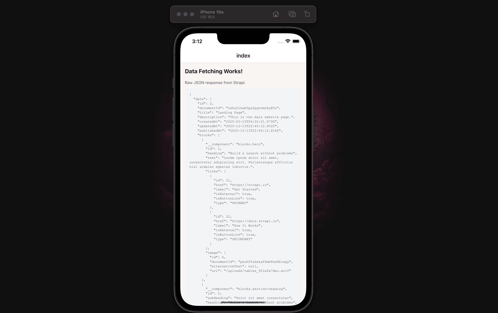

If you see an error, check:
- Strapi is running (`npm run develop` in the server folder)
- API permissions are set (Settings → Roles → Public → check find/findOne)
- For physical devices, use your computer's IP address

---

## Part 6: Building the Landing Page UI - Step by Step

Now that we've confirmed data fetching works, let's build the UI progressively. We'll start with the Hero component, test it, then add the remaining blocks.

### Step 6.1: Install Image Dependencies

```bash
npx expo install expo-image
```

### Step 6.2: Create StrapiImage Component

Create `components/strapi-image.tsx`:

```typescript
import { Image, ImageProps } from "expo-image";
import { getStrapiMedia } from "@/lib/utils";

interface StrapiImageProps extends Omit<ImageProps, "source"> {
  src: string;
  alt?: string;
}

export function StrapiImage({ src, alt, ...props }: StrapiImageProps) {
  const imageUrl = getStrapiMedia(src);

  if (!imageUrl) return null;

  return (
    <Image
      source={{ uri: imageUrl }}
      accessibilityLabel={alt}
      placeholder={{ blurhash: "L6PZfSi_.AyE_3t7t7R**0o#DgR4" }}
      transition={200}
      {...props}
    />
  );
}
```

> **Important:** Unlike web, you must use explicit `style` dimensions (not `className`) for images to display on iOS/Android.

### Step 6.3: Create the Hero Component

Let's start with just the Hero block. Create `components/blocks/hero.tsx`:

```typescript
import { View, Text, Pressable, Linking } from "react-native";
import { Ionicons } from "@expo/vector-icons";
import { StrapiImage } from "@/components/strapi-image";
import type { IHero } from "@/types";

export function Hero({
  subHeading,
  heading,
  highlightedText,
  text,
  links,
  image,
}: Readonly<IHero>) {
  const handlePress = (href: string, isExternal: boolean) => {
    if (isExternal) {
      Linking.openURL(href);
    }
  };

  return (
    <View className="bg-[#F9F5F2] py-12 px-4">
      <View className="w-full max-w-6xl mx-auto">
        {/* Image */}
        <View className="w-full mb-8">
          <StrapiImage
            src={image.url}
            alt={image.alternativeText || heading}
            style={{ width: "100%", height: 192, borderRadius: 8 }}
            contentFit="cover"
          />
        </View>

        {/* Content */}
        <View className="items-center">
          {subHeading && (
            <Text className="text-base text-gray-600 mb-2">{subHeading}</Text>
          )}

          <Text className="text-3xl font-bold text-center text-gray-900">
            {heading}
          </Text>

          {highlightedText && (
            <View className="bg-[#e7f192] px-3 py-1 mt-3 rotate-2 border-2 border-black">
              <Text className="text-2xl font-bold">{highlightedText}</Text>
            </View>
          )}

          <Text className="text-base text-gray-600 text-center mt-4 px-4">
            {text}
          </Text>

          {links.length > 0 && (
            <View className="flex-row flex-wrap justify-center gap-3 mt-6">
              {links.map((link, index) => (
                <Pressable
                  key={`link-${link.id}-${index}`}
                  onPress={() => handlePress(link.href, link.isExternal)}
                  className={`flex-row items-center px-6 py-3 rounded-lg border-2 border-black ${
                    index === 0 ? "bg-[#c4a1ff]" : "bg-white"
                  }`}
                >
                  <Text className="font-semibold text-base">{link.label}</Text>
                  {index === 0 && (
                    <Ionicons
                      name="arrow-forward"
                      size={18}
                      color="black"
                      style={{ marginLeft: 8 }}
                    />
                  )}
                </Pressable>
              ))}
            </View>
          )}
        </View>
      </View>
    </View>
  );
}
```

### Step 6.4: Create a Simple Block Renderer with Just Hero

Create `components/blocks/block-renderer.tsx`:

```typescript
import { View, Text } from "react-native";
import { Hero } from "./hero";
import type { Block } from "@/types";

interface BlockRendererProps {
  blocks: Block[];
}

export function BlockRenderer({ blocks }: Readonly<BlockRendererProps>) {
  const renderBlock = (block: Block) => {
    switch (block.__component) {
      case "blocks.hero":
        return <Hero {...block} />;
      default:
        // Show a placeholder for unimplemented blocks
        return (
          <View className="p-4 m-4 bg-yellow-100 border border-yellow-400 rounded">
            <Text className="text-yellow-800">
              Block not implemented: {block.__component}
            </Text>
          </View>
        );
    }
  };

  return (
    <View>
      {blocks.map((block, index) => (
        <View key={`${block.__component}-${block.id}-${index}`}>
          {renderBlock(block)}
        </View>
      ))}
    </View>
  );
}
```

Create `components/blocks/index.ts`:

```typescript
export { BlockRenderer } from "./block-renderer";
export { Hero } from "./hero";
```

### Step 6.5: Update Index to Use BlockRenderer

Now update `app/index.tsx` to render the blocks:

```typescript
import { Text, View, ActivityIndicator, ScrollView } from "react-native";
import { useLandingPage } from "@/hooks/useLandingPage";
import { BlockRenderer } from "@/components/blocks";
import type { Block } from "@/types";

export default function Index() {
  const { data, isLoading, error } = useLandingPage();

  if (isLoading) {
    return (
      <View className="flex-1 items-center justify-center bg-[#F9F5F2]">
        <ActivityIndicator size="large" color="#c4a1ff" />
        <Text className="mt-4 text-gray-600">Loading...</Text>
      </View>
    );
  }

  if (error) {
    return (
      <View className="flex-1 items-center justify-center bg-[#F9F5F2] p-8">
        <Text className="text-xl font-bold text-red-500">Error</Text>
        <Text className="mt-2 text-center text-gray-700">
          {error.message || "Failed to load landing page"}
        </Text>
      </View>
    );
  }

  const landingPage = data?.data;
  const blocks = (landingPage?.blocks || []) as Block[];

  return (
    <ScrollView className="flex-1 bg-[#F9F5F2]">
      <BlockRenderer blocks={blocks} />
    </ScrollView>
  );
}
```

Run the app now. You should see:
- The Hero block rendered properly with image, heading, text, and buttons
- Yellow placeholder boxes for the other blocks (SectionHeading, CardGrid, etc.)

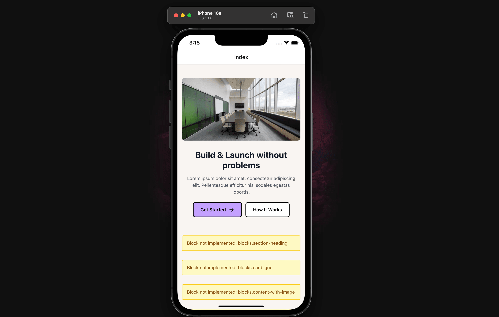

This confirms our BlockRenderer pattern is working!

### Step 6.6: Add the Remaining Block Components

Now let's add all the other block components.

**Create `components/blocks/section-heading.tsx`:**

```typescript
import { View, Text } from "react-native";
import type { ISectionHeading } from "@/types";

export function SectionHeading({
  subHeading,
  heading,
}: Readonly<ISectionHeading>) {
  return (
    <View className="bg-[#F9F5F2] pt-12 pb-6 px-4">
      <View className="w-full max-w-6xl mx-auto">
        <Text className="text-lg text-gray-600 mb-2">{subHeading}</Text>
        <Text className="text-2xl font-bold text-gray-900">{heading}</Text>
      </View>
    </View>
  );
}
```

**Create `components/blocks/card-grid.tsx`:**

```typescript
import { View, Text, ScrollView } from "react-native";
import { Ionicons } from "@expo/vector-icons";
import { StrapiImage } from "@/components/strapi-image";
import type { ICardGrid } from "@/types";

const cardVariants = [
  "bg-[#C4A1FF]",
  "bg-[#E7F193]",
  "bg-[#C4FF83]",
  "bg-[#FFB3BA]",
  "bg-[#A1D4FF]",
  "bg-[#FFDAA1]",
] as const;

const fallbackIcons = [
  "star",
  "heart",
  "flash",
  "rocket",
  "bulb",
  "diamond",
] as const;

function getCardVariant(index: number) {
  return cardVariants[index % cardVariants.length];
}

function getFallbackIcon(index: number) {
  return fallbackIcons[index % fallbackIcons.length];
}

export function CardGrid({
  subHeading,
  heading,
  cards,
}: Readonly<ICardGrid>) {
  return (
    <View className="bg-[#F9F5F2] py-12">
      {(subHeading || heading) && (
        <View className="px-4 mb-6">
          <View className="w-full max-w-6xl mx-auto">
            {subHeading && (
              <Text className="text-lg text-gray-600 mb-2">{subHeading}</Text>
            )}
            {heading && (
              <Text className="text-2xl font-bold text-gray-900">{heading}</Text>
            )}
          </View>
        </View>
      )}

      <ScrollView
        horizontal
        showsHorizontalScrollIndicator={false}
        contentContainerClassName="px-4 gap-4"
      >
        {cards.map((card, index) => (
          <View
            key={`card-${card.id}-${index}`}
            className="w-64 p-5 bg-white border-2 border-black rounded-lg"
          >
            <View
              className={`w-14 h-14 rounded-full border-2 border-black items-center justify-center mb-4 ${getCardVariant(index)}`}
            >
              {card.icon ? (
                <StrapiImage
                  src={card.icon.url}
                  alt={card.icon.alternativeText || card.heading}
                  style={{ width: 32, height: 32 }}
                  contentFit="contain"
                />
              ) : (
                <Ionicons
                  name={getFallbackIcon(index)}
                  size={24}
                  color="black"
                />
              )}
            </View>

            <Text className="text-lg font-bold text-gray-900 mb-2">
              {card.heading}
            </Text>
            <Text className="text-sm text-gray-600 leading-relaxed">
              {card.text}
            </Text>
          </View>
        ))}
      </ScrollView>
    </View>
  );
}
```

**Create `components/blocks/content-with-image.tsx`:**

```typescript
import { View, Text, Pressable, Linking } from "react-native";
import { StrapiImage } from "@/components/strapi-image";
import type { IContentWithImage } from "@/types";

export function ContentWithImage({
  reversed,
  heading,
  subHeading,
  content,
  link,
  image,
}: Readonly<IContentWithImage>) {
  const handlePress = () => {
    if (link?.href) {
      if (link.isExternal) {
        Linking.openURL(link.href);
      }
    }
  };

  return (
    <View className="bg-white py-12 px-4">
      <View className="w-full max-w-6xl mx-auto">
        <View className="mb-8">
          <View className="relative">
            <View className="absolute inset-0 bg-[#c4a1ff] translate-x-2 translate-y-2 rounded-lg" />
            <View className="relative border-2 border-black rounded-lg overflow-hidden bg-white">
              <StrapiImage
                src={image.url}
                alt={image.alternativeText || heading}
                style={{ width: "100%", height: 192 }}
                contentFit="cover"
              />
            </View>
          </View>
        </View>

        <View>
          {subHeading && (
            <View className="bg-[#e7f192] self-start px-3 py-1 mb-4 border border-black rounded">
              <Text className="text-sm font-medium">{subHeading}</Text>
            </View>
          )}

          <Text className="text-2xl font-bold text-gray-900 mb-4">
            {heading}
          </Text>

          <Text className="text-base text-gray-600 leading-relaxed mb-6">
            {content}
          </Text>

          {link?.href && link.label && (
            <Pressable
              onPress={handlePress}
              className="self-start bg-black px-6 py-3 rounded-lg"
            >
              <Text className="text-white font-semibold">
                {link.label} →
              </Text>
            </Pressable>
          )}
        </View>
      </View>
    </View>
  );
}
```

**Install markdown dependencies:**

```bash
npm install react-native-markdown-display
```

**Create `components/blocks/markdown-text.tsx`:**

```typescript
import { View, StyleSheet } from "react-native";
import Markdown from "react-native-markdown-display";
import type { IMarkdownText } from "@/types";

const markdownStyles = StyleSheet.create({
  body: { fontSize: 16, lineHeight: 24, color: "#374151" },
  heading1: { fontSize: 32, fontWeight: "bold", color: "#111827", marginBottom: 16, marginTop: 24 },
  heading2: { fontSize: 24, fontWeight: "bold", color: "#111827", marginBottom: 12, marginTop: 20 },
  heading3: { fontSize: 20, fontWeight: "bold", color: "#111827", marginBottom: 8, marginTop: 16 },
  paragraph: { fontSize: 16, lineHeight: 26, color: "#4B5563", marginBottom: 16 },
  link: { color: "#7C3AED", textDecorationLine: "underline" },
  blockquote: {
    backgroundColor: "#F3F4F6",
    borderLeftWidth: 4,
    borderLeftColor: "#7C3AED",
    paddingLeft: 16,
    paddingVertical: 8,
    marginVertical: 16,
    fontStyle: "italic",
  },
  fence: {
    backgroundColor: "#1F2937",
    borderRadius: 8,
    padding: 16,
    marginVertical: 16,
    color: "#F9FAFB",
    fontFamily: "monospace",
    fontSize: 14,
  },
});

export function MarkdownText({ content }: Readonly<IMarkdownText>) {
  return (
    <View className="py-12 px-4">
      <View className="w-full max-w-4xl mx-auto">
        <Markdown style={markdownStyles}>{content}</Markdown>
      </View>
    </View>
  );
}
```

**Create `components/blocks/faqs.tsx`:**

```typescript
import { useState } from "react";
import { View, Text, Pressable } from "react-native";
import { Ionicons } from "@expo/vector-icons";
import type { IFaqs } from "@/types";

export function Faqs({ heading, subHeading, faq }: Readonly<IFaqs>) {
  const [openIndex, setOpenIndex] = useState<number | null>(null);

  const toggleFAQ = (index: number) => {
    setOpenIndex(openIndex === index ? null : index);
  };

  return (
    <View className="w-full py-12 bg-[#f5f3e8] px-4">
      <View className="items-center mb-8">
        <Text className="text-2xl font-bold text-gray-900 text-center mb-2">
          {heading || "Frequently Asked Questions"}
        </Text>
        {subHeading && (
          <Text className="text-base text-gray-600 text-center max-w-lg">
            {subHeading}
          </Text>
        )}
      </View>

      <View className="w-full max-w-3xl mx-auto">
        {faq.map((item, index) => (
          <View
            key={`faq-${item.id}-${index}`}
            className={`mb-4 border-2 border-black bg-white rounded-lg overflow-hidden ${
              openIndex === index ? "shadow-lg" : "shadow-md"
            }`}
          >
            <Pressable
              onPress={() => toggleFAQ(index)}
              className="flex-row justify-between items-center p-4"
            >
              <Text className="flex-1 font-bold text-base text-gray-900 pr-4">
                {item.heading}
              </Text>
              <Ionicons
                name={openIndex === index ? "chevron-up" : "chevron-down"}
                size={24}
                color="black"
              />
            </Pressable>

            {openIndex === index && (
              <View className="px-4 pb-4 border-t border-dashed border-gray-300">
                <Text className="text-base text-gray-600 pt-4 leading-relaxed">
                  {item.text}
                </Text>
              </View>
            )}
          </View>
        ))}
      </View>
    </View>
  );
}
```

### Step 6.7: Update BlockRenderer with All Blocks

Update `components/blocks/block-renderer.tsx`:

```typescript
import { View } from "react-native";
import { Hero } from "./hero";
import { SectionHeading } from "./section-heading";
import { CardGrid } from "./card-grid";
import { ContentWithImage } from "./content-with-image";
import { MarkdownText } from "./markdown-text";
import { Faqs } from "./faqs";
import type { Block } from "@/types";

interface BlockRendererProps {
  blocks: Block[];
}

export function BlockRenderer({ blocks }: Readonly<BlockRendererProps>) {
  const renderBlock = (block: Block) => {
    switch (block.__component) {
      case "blocks.hero":
        return <Hero {...block} />;
      case "blocks.section-heading":
        return <SectionHeading {...block} />;
      case "blocks.card-grid":
        return <CardGrid {...block} />;
      case "blocks.content-with-image":
        return <ContentWithImage {...block} />;
      case "blocks.markdown":
        return <MarkdownText {...block} />;
      case "blocks.faqs":
        return <Faqs {...block} />;
      default:
        return null;
    }
  };

  return (
    <View>
      {blocks.map((block, index) => (
        <View key={`${block.__component}-${block.id}-${index}`}>
          {renderBlock(block)}
        </View>
      ))}
    </View>
  );
}
```

Update `components/blocks/index.ts`:

```typescript
export { BlockRenderer } from "./block-renderer";
export { Hero } from "./hero";
export { SectionHeading } from "./section-heading";
export { CardGrid } from "./card-grid";
export { ContentWithImage } from "./content-with-image";
export { MarkdownText } from "./markdown-text";
export { Faqs } from "./faqs";
```

Run the app again. You should now see the complete landing page with all blocks rendering properly!


---

## Part 7: Adding Tab Navigation and Blog List

Now let's add a second screen to display blog articles with tab navigation.

### Step 7.1: Create Article Hooks

Create `hooks/useArticles.ts`:

```typescript
import { useQuery, useInfiniteQuery } from "@tanstack/react-query";
import { getArticles, getArticleBySlug } from "@/data/loaders";

export function useArticles(params?: { page?: number; tag?: string }) {
  return useQuery({
    queryKey: ["articles", params],
    queryFn: () => getArticles(params),
  });
}

export function useInfiniteArticles(tag?: string) {
  return useInfiniteQuery({
    queryKey: ["articles", "infinite", tag],
    queryFn: ({ pageParam = 1 }) => getArticles({ page: pageParam, tag }),
    initialPageParam: 1,
    getNextPageParam: (lastPage) => {
      const { page, pageCount } = lastPage.meta.pagination || { page: 1, pageCount: 1 };
      return page < pageCount ? page + 1 : undefined;
    },
  });
}

export function useArticleBySlug(slug: string) {
  return useQuery({
    queryKey: ["article", slug],
    queryFn: () => getArticleBySlug(slug),
    enabled: !!slug,
  });
}
```

### Step 7.2: Create Tab Navigation Layout

Create the tabs folder and layout. First, create `app/(tabs)/_layout.tsx`:

```typescript
import { Tabs } from "expo-router";
import { Ionicons } from "@expo/vector-icons";

export default function TabLayout() {
  return (
    <Tabs
      screenOptions={{
        tabBarActiveTintColor: "#c4a1ff",
        tabBarInactiveTintColor: "#6B7280",
        tabBarStyle: {
          backgroundColor: "#F9F5F2",
          borderTopColor: "#E5E7EB",
          borderTopWidth: 1,
        },
        headerStyle: {
          backgroundColor: "#F9F5F2",
        },
        headerTintColor: "#111827",
        headerTitleStyle: {
          fontWeight: "bold",
        },
      }}
    >
      <Tabs.Screen
        name="index"
        options={{
          title: "Home",
          tabBarIcon: ({ color, size }) => (
            <Ionicons name="home" size={size} color={color} />
          ),
        }}
      />
      <Tabs.Screen
        name="blog"
        options={{
          title: "Blog",
          tabBarIcon: ({ color, size }) => (
            <Ionicons name="newspaper" size={size} color={color} />
          ),
        }}
      />
    </Tabs>
  );
}
```

### Step 7.3: Move Home Screen to Tabs

Move your index screen to `app/(tabs)/index.tsx`:

```typescript
import { Text, View, ActivityIndicator, ScrollView } from "react-native";
import { useLandingPage } from "@/hooks/useLandingPage";
import { BlockRenderer } from "@/components/blocks";
import type { Block } from "@/types";

export default function HomeScreen() {
  const { data, isLoading, error } = useLandingPage();

  if (isLoading) {
    return (
      <View className="flex-1 items-center justify-center bg-[#F9F5F2]">
        <ActivityIndicator size="large" color="#c4a1ff" />
        <Text className="mt-4 text-gray-600">Loading...</Text>
      </View>
    );
  }

  if (error) {
    return (
      <View className="flex-1 items-center justify-center bg-[#F9F5F2] p-8">
        <Text className="text-xl font-bold text-red-500">Error</Text>
        <Text className="mt-2 text-center text-gray-700">
          {error.message || "Failed to load landing page"}
        </Text>
      </View>
    );
  }

  const landingPage = data?.data;
  const blocks = (landingPage?.blocks || []) as Block[];

  return (
    <ScrollView className="flex-1 bg-[#F9F5F2]">
      <BlockRenderer blocks={blocks} />
    </ScrollView>
  );
}
```

Delete the old `app/index.tsx` file if it exists.

### Step 7.4: Create Article Card Component

Create `components/article-card.tsx`:

```typescript
import { View, Text, Pressable } from "react-native";
import { useRouter, Href } from "expo-router";
import { StrapiImage } from "@/components/strapi-image";
import type { Article } from "@/types";

interface ArticleCardProps {
  article: Article;
}

export function ArticleCard({ article }: ArticleCardProps) {
  const router = useRouter();

  const handlePress = () => {
    router.push(`/article/${article.slug}` as Href);
  };

  const formattedDate = new Date(article.publishedAt).toLocaleDateString("en-US", {
    year: "numeric",
    month: "short",
    day: "numeric",
  });

  return (
    <Pressable
      onPress={handlePress}
      className="bg-white border-2 border-black rounded-lg overflow-hidden mb-4 active:opacity-80"
    >
      {article.featuredImage && (
        <StrapiImage
          src={article.featuredImage.url}
          alt={article.featuredImage.alternativeText || article.title}
          style={{ width: "100%", height: 160 }}
          contentFit="cover"
        />
      )}

      <View className="p-4">
        {article.contentTags && article.contentTags.length > 0 && (
          <View className="flex-row flex-wrap gap-2 mb-2">
            {article.contentTags.slice(0, 3).map((tag) => (
              <View
                key={tag.id}
                className="bg-[#e7f192] px-2 py-1 rounded border border-black"
              >
                <Text className="text-xs font-medium">{tag.title}</Text>
              </View>
            ))}
          </View>
        )}

        <Text className="text-lg font-bold text-gray-900 mb-2" numberOfLines={2}>
          {article.title}
        </Text>

        <Text className="text-sm text-gray-600 mb-3" numberOfLines={2}>
          {article.description}
        </Text>

        <View className="flex-row items-center justify-between">
          {article.author && (
            <Text className="text-xs text-gray-500">
              By {article.author.fullName}
            </Text>
          )}
          <Text className="text-xs text-gray-400">{formattedDate}</Text>
        </View>
      </View>
    </Pressable>
  );
}
```

### Step 7.5: Create Blog List Screen with Infinite Scroll

Create `app/(tabs)/blog.tsx`:

```typescript
import { Text, View, ActivityIndicator, FlatList, RefreshControl } from "react-native";
import { useState, useCallback, useMemo } from "react";
import { useInfiniteArticles } from "@/hooks/useArticles";
import { ArticleCard } from "@/components/article-card";
import type { Article } from "@/types";

export default function BlogScreen() {
  const [refreshing, setRefreshing] = useState(false);
  const {
    data,
    isLoading,
    error,
    refetch,
    fetchNextPage,
    hasNextPage,
    isFetchingNextPage,
  } = useInfiniteArticles();

  const onRefresh = useCallback(async () => {
    setRefreshing(true);
    await refetch();
    setRefreshing(false);
  }, [refetch]);

  const onEndReached = useCallback(() => {
    if (hasNextPage && !isFetchingNextPage) {
      fetchNextPage();
    }
  }, [hasNextPage, isFetchingNextPage, fetchNextPage]);

  const articles = useMemo(() => {
    return data?.pages.flatMap((page) => page.data) || [];
  }, [data]);

  const totalCount = data?.pages[0]?.meta?.pagination?.total || 0;

  if (isLoading && !refreshing) {
    return (
      <View className="flex-1 items-center justify-center bg-[#F9F5F2]">
        <ActivityIndicator size="large" color="#c4a1ff" />
        <Text className="mt-4 text-gray-600">Loading articles...</Text>
      </View>
    );
  }

  if (error) {
    return (
      <View className="flex-1 items-center justify-center bg-[#F9F5F2] p-8">
        <Text className="text-xl font-bold text-red-500">Error</Text>
        <Text className="mt-2 text-center text-gray-700">
          {error.message || "Failed to load articles"}
        </Text>
      </View>
    );
  }

  const renderItem = ({ item }: { item: Article }) => (
    <ArticleCard article={item} />
  );

  const renderHeader = () => (
    <View className="mb-4">
      <Text className="text-2xl font-bold text-gray-900">Latest Articles</Text>
      <Text className="text-gray-600 mt-1">
        {totalCount} article{totalCount !== 1 ? "s" : ""}
      </Text>
    </View>
  );

  const renderFooter = () => {
    if (!isFetchingNextPage) return null;
    return (
      <View className="py-4">
        <ActivityIndicator size="small" color="#c4a1ff" />
      </View>
    );
  };

  return (
    <View className="flex-1 bg-[#F9F5F2]">
      <FlatList
        data={articles}
        renderItem={renderItem}
        keyExtractor={(item) => item.documentId}
        contentContainerStyle={{ padding: 16 }}
        ListHeaderComponent={renderHeader}
        ListFooterComponent={renderFooter}
        refreshControl={
          <RefreshControl
            refreshing={refreshing}
            onRefresh={onRefresh}
            tintColor="#c4a1ff"
          />
        }
        onEndReached={onEndReached}
        onEndReachedThreshold={0.5}
        showsVerticalScrollIndicator={false}
      />
    </View>
  );
}
```

Run the app now. You should see:
- Tab navigation at the bottom with Home and Blog tabs
- Home tab showing the landing page with all blocks
- Blog tab showing the list of articles with infinite scroll

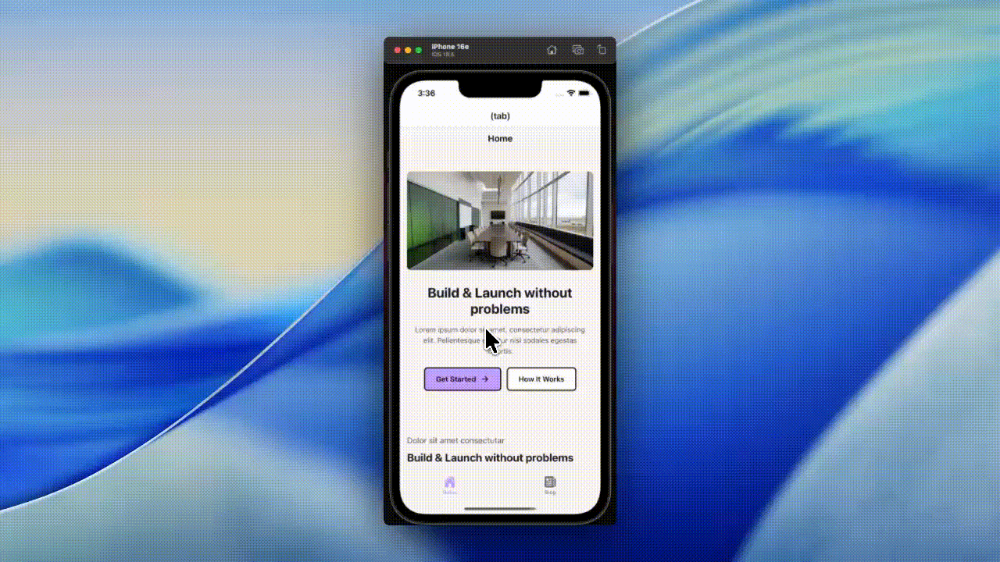

---

## Part 8: Article Detail Page

Finally, let's create the article detail page to view full articles.

### Step 8.1: Create Article Detail Screen

Create `app/article/[slug].tsx`:

```typescript
import { Text, View, ActivityIndicator, ScrollView, StyleSheet } from "react-native";
import { useLocalSearchParams, Stack } from "expo-router";
import Markdown from "react-native-markdown-display";
import { useArticleBySlug } from "@/hooks/useArticles";
import { StrapiImage } from "@/components/strapi-image";

const markdownStyles = StyleSheet.create({
  body: { fontSize: 16, lineHeight: 26, color: "#374151" },
  heading1: { fontSize: 28, fontWeight: "bold", color: "#111827", marginBottom: 16, marginTop: 24 },
  heading2: { fontSize: 22, fontWeight: "bold", color: "#111827", marginBottom: 12, marginTop: 20 },
  paragraph: { fontSize: 16, lineHeight: 26, color: "#4B5563", marginBottom: 16 },
  link: { color: "#7C3AED", textDecorationLine: "underline" },
  blockquote: {
    backgroundColor: "#F3F4F6",
    borderLeftWidth: 4,
    borderLeftColor: "#c4a1ff",
    paddingLeft: 16,
    paddingVertical: 8,
    marginVertical: 16,
    fontStyle: "italic",
  },
  fence: {
    backgroundColor: "#1F2937",
    borderRadius: 8,
    padding: 16,
    marginVertical: 16,
    color: "#F9FAFB",
    fontFamily: "monospace",
    fontSize: 14,
  },
});

export default function ArticleDetailScreen() {
  const { slug } = useLocalSearchParams<{ slug: string }>();
  const { data, isLoading, error } = useArticleBySlug(slug || "");

  if (isLoading) {
    return (
      <View className="flex-1 items-center justify-center bg-[#F9F5F2]">
        <ActivityIndicator size="large" color="#c4a1ff" />
        <Text className="mt-4 text-gray-600">Loading article...</Text>
      </View>
    );
  }

  if (error || !data?.data?.[0]) {
    return (
      <View className="flex-1 items-center justify-center bg-[#F9F5F2] p-8">
        <Text className="text-xl font-bold text-red-500">Error</Text>
        <Text className="mt-2 text-center text-gray-700">
          {error?.message || "Article not found"}
        </Text>
      </View>
    );
  }

  const article = data.data[0];

  const formattedDate = new Date(article.publishedAt).toLocaleDateString("en-US", {
    year: "numeric",
    month: "long",
    day: "numeric",
  });

  return (
    <>
      <Stack.Screen
        options={{
          title: "",
          headerStyle: { backgroundColor: "#F9F5F2" },
          headerTintColor: "#111827",
        }}
      />
      <ScrollView className="flex-1 bg-[#F9F5F2]">
        {article.featuredImage && (
          <StrapiImage
            src={article.featuredImage.url}
            alt={article.featuredImage.alternativeText || article.title}
            style={{ width: "100%", height: 220 }}
            contentFit="cover"
          />
        )}

        <View className="p-4">
          {article.contentTags && article.contentTags.length > 0 && (
            <View className="flex-row flex-wrap gap-2 mb-3">
              {article.contentTags.map((tag) => (
                <View
                  key={tag.id}
                  className="bg-[#e7f192] px-3 py-1 rounded border border-black"
                >
                  <Text className="text-xs font-medium">{tag.title}</Text>
                </View>
              ))}
            </View>
          )}

          <Text className="text-2xl font-bold text-gray-900 mb-2">
            {article.title}
          </Text>

          <View className="flex-row items-center mb-4">
            {article.author && (
              <Text className="text-sm text-gray-600">
                By {article.author.fullName}
              </Text>
            )}
            <Text className="text-sm text-gray-400 mx-2">•</Text>
            <Text className="text-sm text-gray-400">{formattedDate}</Text>
          </View>

          <Text className="text-base text-gray-600 mb-6 leading-relaxed">
            {article.description}
          </Text>

          <View className="border-t border-gray-200 pt-6">
            <Markdown style={markdownStyles}>{article.content}</Markdown>
          </View>
        </View>
      </ScrollView>
    </>
  );
}
```

### Step 8.2: Update Root Layout for Navigation

Update `app/_layout.tsx` to configure the stack navigation:

```typescript
import "@/global.css";
import { Stack } from "expo-router";
import { SafeAreaProvider } from "react-native-safe-area-context";
import { QueryClient, QueryClientProvider } from "@tanstack/react-query";

const queryClient = new QueryClient({
  defaultOptions: {
    queries: {
      staleTime: 1000 * 60 * 5,
      retry: 3,
    },
  },
});

export default function RootLayout() {
  return (
    <QueryClientProvider client={queryClient}>
      <SafeAreaProvider>
        <Stack>
          <Stack.Screen name="(tabs)" options={{ headerShown: false }} />
          <Stack.Screen
            name="article/[slug]"
            options={{
              headerBackTitle: "Back",
              headerStyle: { backgroundColor: "#F9F5F2" },
              headerTintColor: "#111827",
            }}
          />
        </Stack>
      </SafeAreaProvider>
    </QueryClientProvider>
  );
}
```

---

## Part 9: Running the Complete App


### Start Both Servers

Open two terminal windows:

**Terminal 1 - Strapi:**
```bash
cd server
npm run develop
```

**Terminal 2 - Expo:**
```bash
cd client
npx expo start --go --clear
```

### Test the Complete Flow

1. Scan the QR code with Expo Go
2. **Home Tab**: See the landing page with Hero, CardGrid, FAQs, etc.
3. **Blog Tab**: See the list of articles with infinite scroll
4. **Tap an article**: Navigate to the detail page with full content
5. **Pull to refresh**: Reload the article list
6. **Scroll to bottom**: Load more articles automatically

---

## Troubleshooting

### Images Not Loading on iOS/Android

1. **Use explicit style dimensions:**
   ```typescript
   // Wrong
   <StrapiImage className="w-full h-48" ... />

   // Correct
   <StrapiImage style={{ width: "100%", height: 192 }} ... />
   ```

2. **Use your computer's IP instead of localhost:**
   ```
   # .env
   EXPO_PUBLIC_STRAPI_URL=http://192.168.1.100:1337
   ```

3. **Restart with cleared cache:**
   ```bash
   npx expo start --go --clear
   ```

### Network Request Failed

- Ensure Strapi is running
- Check your phone and computer are on the same WiFi
- Verify API permissions in Strapi admin

### "(tabs)" Showing in Navigation

Add `headerShown: false` to the tabs Stack.Screen in your root layout.

---

## Final Project Structure

```
your-project/
├── client/
│   ├── app/
│   │   ├── _layout.tsx
│   │   ├── (tabs)/
│   │   │   ├── _layout.tsx
│   │   │   ├── index.tsx
│   │   │   └── blog.tsx
│   │   └── article/
│   │       └── [slug].tsx
│   ├── components/
│   │   ├── article-card.tsx
│   │   ├── strapi-image.tsx
│   │   └── blocks/
│   │       ├── index.ts
│   │       ├── block-renderer.tsx
│   │       ├── hero.tsx
│   │       ├── section-heading.tsx
│   │       ├── card-grid.tsx
│   │       ├── content-with-image.tsx
│   │       ├── markdown-text.tsx
│   │       └── faqs.tsx
│   ├── data/
│   │   └── loaders.ts
│   ├── hooks/
│   │   ├── useArticles.ts
│   │   └── useLandingPage.ts
│   ├── lib/
│   │   ├── strapi-api.ts
│   │   └── utils.ts
│   ├── types/
│   │   └── index.ts
│   ├── global.css
│   ├── tailwind.config.js
│   └── package.json
└── server/
    └── ... (Strapi)
```

---

## Next Steps

Now that you have a working app, consider:

1. **Add Authentication** - Implement user login with Strapi's auth
2. **Create Development Builds** - Build custom native apps for production
3. **Add More Block Types** - Extend the block renderer with new components
4. **Implement Search** - Add article search functionality
5. **Deploy Strapi** - Host your backend on a cloud provider

---

## Resources

- [Expo Documentation](https://docs.expo.dev/)
- [NativeWind Documentation](https://www.nativewind.dev/)
- [Strapi Documentation](https://docs.strapi.io/)
- [React Query Documentation](https://tanstack.com/query/latest)
- [Expo Router Documentation](https://docs.expo.dev/router/introduction/)

---

Happy coding! If you have questions or run into issues, check the Expo and Strapi Discord communities for help.
# expo-strapi-blog-with-example-project
